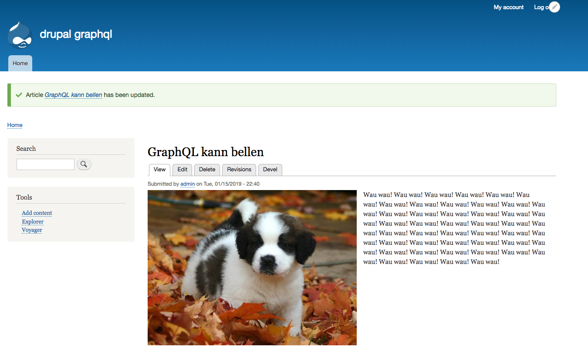

### Getting Started

1. initialize frontend app in `./frontend`

   ```
   $ cd frontend

   # install deps
   $ yarn

   # first time make scripts executable
   $ chmod +x scripts/start.sh

   $ yarn start
   # add backend drupal uri at bash prompt
   ```

2. configure local php settings by following instructions on the top of `web/sites/development.services.yml`

   ```sh
   ### From web/sites/development.services.yml

   # Local development services.
   #
   # To activate this feature, follow the instructions at the top of the
   # 'example.settings.local.php' file, which sits next to this file.
   ```

3. install [lando](https://docs.devwithlando.io/) for Drupal/Drush CLI usage

---


